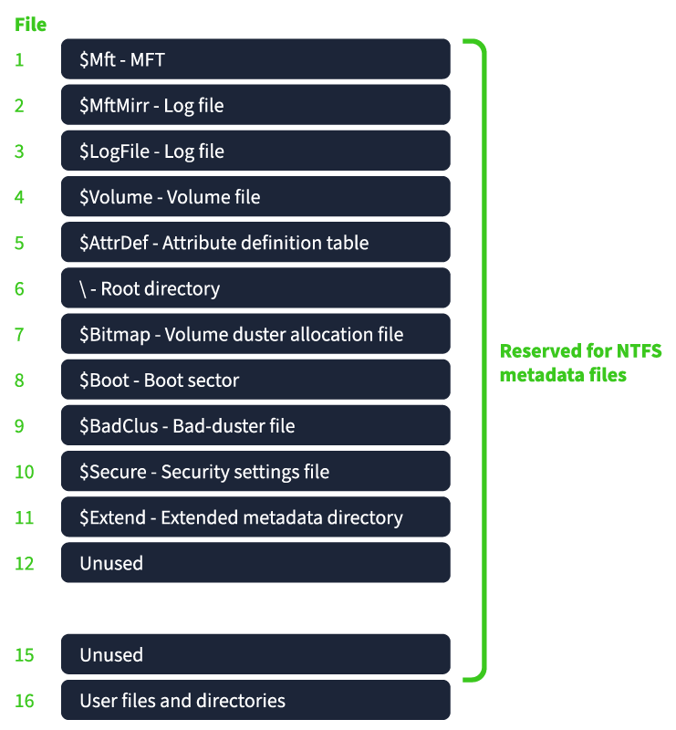
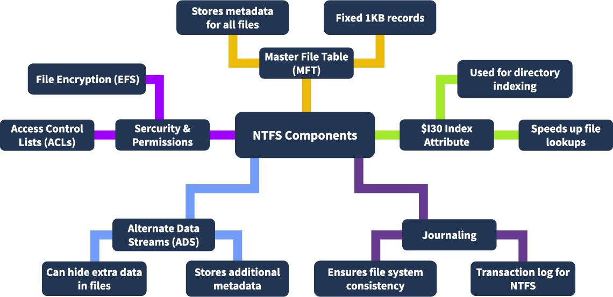

##### Check if your system uses BIOS or UEFI firmware:
Windows -
- `WIN+R -> msinfo32` *BIOS MODE:* Legacy (for BIOS) or UEFI
##### FInd disk's partitioning scheme (MBR or GPT) and type:
Windows - 
- $PS `Get-Disk` -> *Partition Style* column (scheme)
- $PS `Get-Partition` -> *Type* column (type) 
Linux - 
- `sudo (fdisk|parted) -l`   -> *Disklabel type*(fdisk) or *Partition Table*(parted) for scheme
-  `lsblk -f`   -> *FSTYPE* column for type

---
#### Analysing MBR disks

##### MBR layout (1st sector - 512 bytes):

| Section:                                             | Range/Size (bytes): |
| ---------------------------------------------------- | ------------------- |
| **Bootloader**                                       | 0-445 (446)         |
| **Partition table** (4 partitions, 16 bytes each) | 446-509 (64)        |
| **MBR signature**                                    | 510-511 (2)         |

##### How to locate position on disk of one of the 4 partitions:
- first find offset of partition *start LBA address:
	`446 (bootloader) + 8 (start LBA) (+16 if part2/+32 p3/+48 p4)`
- reverse the 4 hex bytes at this offset due to little-endianess & convert to decimal * 512 (sector size) = *decimal offset position on disk of partition.
- can then search for this dec offset in hex editor (eg. HxD) to jump to this partition's data.
##### Calculating the size of a partition:
- locate the 4 bytes at partition's *number of sectors field* (offset 12):
	`446 + 12 (+{16|32|48} if part2-4) 
- convert bytes to decimal (reversed due to little-endian format)  * 512 = *partition size in bytes*
##### Check if partition is bootable:
- check byte at *boot indicator* field (offset 0): `80`= bootable, `00`= non-bootable
##### Find partition type of a partition:
- check byte at *partition type* field (offset 8) of the partition (eg. `07` is NTFS)
#### Indicators of disk image boot sector corruption:
- correct **boot signature** (aka **magic number**) should be: `55 AA`  (at offset **0x1FE**)
- use **HxD** or similar to fix the corrupted bytes by editing them back to 55AA.
- then can use **FTK Imager** (forensic tool to examine disk images) to view the fixed image

---
#### Analysing GPT disks

##### GPT layout:

| Section:                                                                                                                                                                                                                           | Range/Size (bytes):          |
| ---------------------------------------------------------------------------------------------------------------------------------------------------------------------------------------------------------------------------------- | ---------------------------- |
| **Protective MBR** (sector 0)   - bootloader code - usually all `00` bytes   - partition table - only 1 partition used - 16 bytes (*4th byte:`EE` indicates GPT-format*), rest are `00` bytes   - MBR signature - `55 AA` | 0-511 (512)                  |
| **Primary GPT Header** (sector 1) - *first 92 bytes only*, rest are `00` bytes                                                                                                                                                     | 512-1023 (512)            |
| **Partition Entry Array** (from sector 2) - *128 partitions*, each are 128 byte blocks, then rest of unallocated partitions are `00` bytes.                                                                                        | 1024- 66560 (512* 128) |
| **Backup GPT Header**                                                                                                                                                                                                              | 512                          |
| **Backup Partition Entry Array**                                                                                                                                                                                                   | 512 * 128                    |
> *Note:* unlike MBR disks where the bootloader bootstrap code is in the MBR itself (bootable partition), GPT disks use a separate **EFI System Partition (ESP)** to store it in the form of `.efi` files. 

---
#### FAT32 Analysis

##### FAT32 partition layout:

 - **sector**: smallest addressable unit on a disk. (usually 512 bytes

| Section                                                                                                                                                                                                                                                                                                                                          | Sub-sections                                                                                                                                                                     | Location/Size(bytes)                                                                                                                                              |
| ------------------------------------------------------------------------------------------------------------------------------------------------------------------------------------------------------------------------------------------------------------------------------------------------------------------------------------------------ | -------------------------------------------------------------------------------------------------------------------------------------------------------------------------------- | ----------------------------------------------------------------------------------------------------------------------------------------------------------------- |
| **Reserved area**                                                                                                                                                                                                                                                                                                                             | - **Boot sector**: filesystem metadata (aka *Volume Boot Volume*) - **FSInfo** - Reserved/Undefined sectors - **Backup sector**(0-2) - Reserved/Undefined sectors | - sector 0 (512)    - sector 1 (512) - sectors 2-5 (2048)  - sector 6 (512) - sector 7 till start of FAT                                  |
| **FAT area**  - *FAT entry values*(4 bytes per entry, bigendian format):  `00 00 00 00`: Free cluster 		 `00 00 00 02 - 0F FF FF F6:`  Used cluster: Next Cluster in the Chain is XX   `0F FF FF F7`: Bad cluster    `0F FF FF F8 - 0F FF FF FF`:  End of File (EOF)  `FF FF FF FF`: End of File (EOF) | - **FAT1**  - **FAT2** (backup of FAT1)                                                                                                                                    | - **offset** = *Reserved Sectors* value x 512 - **offset** =  (*Reserved Sectors* value  + *Sectors per FAT* value) x 512 > convert offset to hex/dec |
| **Data area**   - *starts at sector 2*; sectors 0 & 1 are virtual/reserved                                                                                                                                                                                                                                                                 | - **Root directory**   Contains entries for every file/directory.   Two entry types:      - LFN (32 bytes)       - SFN (32 bytes) - **Data**                      | - **offset** =  (*Reserved Sectors* value   + (2 * *Sectors per FAT*)) * 512 > convert offset to hex/dec                                                 |
> The **cluster index number** of the *FAT* entry is where the file or directory starts. This index *always matches* the corresponding index of the cluster in the *data region*.
> 
> **cluster chain**: a group of one or more clusters
##### How to interpret/calculate FAT entries and cluster chains:
- Refer to common FAT entry values in table above
- `example.txt`: 
	  - if content contained in a *chain* of two clusters - clusters 5 & 6
	  - FAT entries (in LE format/HxD view):
	- cluster 5: **06 00 00 00** (`Used cluster - Next Cluster in the Chain`: cluster 6)
	- cluster 6: **FF FF FF 0F** (`End of File`: this is the last cluster of the cluster chain)
- *Note*: FAT32 is little-endian (which is what HxD displays by default) so each FAT entry must be reversed to get the correct big-endian hex value. Cluster 5 above becomes 00 00 00 06 and cluster 6 is 0F FF FF FF.
##### How to find the offset of a cluster (N) for analysis:
- **The "Jump" formula:** *data area* offset + ((N - 2) *  *bytes per cluster*)
	- bytes per cluster = *sectors per cluster*(4) * 512 = 4096 (0x1000)
	- eg. 9th cluster: 00400000 + 7 * 0x1000 = 00407000
##### How to analyse a file entry in the root directory (name/creation date etc.):
> **Long File Name (LFN)**: stores the full name of a file (due to SFN 8.3 limitations) and a reference to its SFN entry
   **Short File Name (SFN)**: stores the files's metadata, eg. attributes and starting cluster of its contents
- **Find a filename**:
	  - find & go to root directory offset - start of data area (use formula in table above)
	  - eg. if analysing 5th file entry, that's at root hex offset +80 (each 32 byte LFN = 0x20)
	  - concat each filename part from the LFN entry to recover in full (bytes 2, 16, and 32)
	  - corresponding SFN entry is immediately after the LFN entry
		  - eg. short file name at byte 1, creation time at byte 15, low word of first cluster at byte 27 (value points to cluster number the file contents are actually stored at)

- **Auto analysis with *Autopsy***:
	- create new case, add disk image/VM and choose `Recent Activity` and `File Type Identification` ingest options.
	- Click on the `File Metadata` tab for more detailed information about the selected file/directory
		- `From the Sleuth Kit istat Tool` section correlates to the SFN entry
- **timestomping** attacks: 
	- modifying the timestamps of files to evade detection. The types of timestamps an attacker can modify: *Creation time, Last access time, Modify time*.
	- detecting:
		- manually - check for anomalies such as `last Access Date` earlier than the `Modified Date`
		- auto - use `Timeline` tab in **Autopsy** with `linear` scale, then look for events containing files with eg. `Accessed timestamp` without any `Creation timestamp` prior to it, or similar anomalous timestamps. 
- **finding deleted files**:
	- manually:
		- go to data area start offset
		- search for deleted entries (they start with the hexadecimal value `E5`)
		- for any found entries, go to cluster N (N is value of the *low word of first cluster* field) which contains the recovered file's contents
	- automated:
		- use **Autopsy** to analyse the directory where the file was deleted and the `$RECYCLE.BIN` directory

---
#### NTFS Analysis

[]

[]
%% Pictures source: TryHackMe %%

##### Collecting NTFS artefacts for analysis
- forensic tool: *FTK Imager  -> can right-click and export them 
- useful/common special system files ($ prefix) to extract:
	-  `$MFT (Master File Table)`
	- `$LogFile`
	- `$I30 (NTFS Index Attribute)`
	- `$Extend`
	    - `$UsnJrnl`

##### How to examine the MFT Record:

>*Note: due to Windows identifying the `$` prefix as a reserved system metafile, you need to enclose the `-f` option value in single quote marks: `' '`. (This protects the value from syntax misinterpretation by the shell, so it reads it as a string, not a variable). Alternatively, run `attrib -s -h $MFT` before MFTECmd to remove hidden + system flags on the file*

- first extract `$MFT` via *FTK Imager*
- MFT extraction tool: *MFTECmd.exe*
	- input a (-f)ile, save CSV output to folder (--csv) with name (--csvf). 
	- eg. : `MFTECmd.exe -f '..\Evidence\$MFT' --csv ..\Evidence --csvf MFT.csv`
	- output identifies *File type*, eg. "Mft", "I30"
-  Can use *Timeline Explorer* - a csv/Excel reader tool - to view the csv output

>**MACB**: refers to the timestamps associated with file system metadata, which provide crucial information about a file's history.
>**M - Modified**: file last changed
>**A - Accessed**: file last read/opened
>**C - Changed (Metadata)**: file metadata last changed
>**B - Birth (Creation)**: file created

##### NTFS Journaling

> *FS Journaling*: OS maintains a transactional record of all changes made to a volume, so in the event of a crash or power failure, the system can roll back the changes or continue where it left off

- Two types of NTFS journals: 
	- `$LogFile` - MFT metadata changes. Located in the `root` directory.
	- `$USNJrnl` - Update Sequence Number Journal to record file/dir changes. Located in the `$Extend` directory. 
		- contains two components: `$Max`(max journal size), and `$J`(actual change records). *$J is very useful for analysis*.
- **Extract the $J File**: 
	- `MFTECmd.exe -f '..\Evidence\$J' --csv ..\Evidence --csvf USNJrnl.csv`

##### Analyzing $I30

> **Index Allocation Attribute** (`$I30`): the directory index that maintains a structured layout for the metadata of files and directories within an NTFS volume.
> **Slack space**: Slack space in $I30 refers to files that are deleted, renamed, or moved within a directory. (Represented by an 'x' symbol over the file icon in FTK Imager). 

- Analyse `$I30` by exporting from FTK Imager then extract relevant info via `MSFECmd.exe` and view the CSV in `Timeline Explorer`.
	- `MFTECmd.exe -f ..\Evidence\$I30 --csv ..\Evidence\ --csvf i30.csv`
	- Use the '`From Slack = True`' column filter in *Timeline Explorer* to identify files deleted from the folder and now only remain as records in Slack space.

---
#### File Carving
> **File Carving**: forensic technique that "carves" out a file's contents from the raw data bytes on a disk using its header & footer signatures (aka *magic bytes*) to search on and reconstruct the file based on signature boundaries. Can extract files even if traditional tools (which rely on intact metadata) can't recover it due to file metadata corruption, deletion, hidden files etc.

- Refer to https://www.garykessler.net/library/file_sigs.html for list of file signatures 

##### Tools:
Manual carving:
- `HxD`/`Okteta`: hex editors to manually identify file boundaries and extract/save content
- `dd`: file/image converter that can be used to extract/carve the file
- `exiftool`: extract metadata from files   
- `binwalk`: analyse and extract data from binaries
Automated carving:
- `Scalpel & Foremost`: both open-source, lightweight file-carving tools
#####  How to use HxD to extract bytes to save file's content:
1. **Select the Block**: Edit > Select block, enter offsets
2. **Copy the Selection**: Edit > Copy
3. **Paste into a New File**: File > New, paste copied bytes (Ctrl-V) 
4. **Save with the Correct Extension**: File > Save as, enter name with correct extension identified (eg. .png, .zip)
##### How to use `dd` to extract files manually:
- first determine file header and (if exists) footer offsets
- subtract offsets, eg. `134484431(Ending) - 134483968 (Starting) = 463 bytes`
- then run dd, eg.: 
	- `$ dd if=Manual_Carve_usb.img of=Image.png bs=1 skip=134483968 count=463`
- after, can run `exiftool` on the extracted file (eg. PNG file above)

##### How to use `binwalk` to recover files (manually) from slack space:

> *Slack space* is the leftover storage on a disk when a file does not need all the space it has been allocated.

- `$ binwalk -e slack_space.img` - (-e)xtracts files carved from img and saves to a dir 

##### How to use `foremost`& `scalpel` for automated recovery of deleted files:

###### foremost:

 >Can create a `/etc/custom_foremost.conf` in addition to the default `/etc/foremost.conf` to include advanced or additional signatures, eg. for proprietary or less common formats.

- (-i)nput a disk image, run with a (-c)ustom config and (-o)utput to specified directory:
	- `$ foremost -i deleted_disk.img -o recovered -c /etc/custom_foremost.conf`
-  can also run it using the `-t` option, to restrict the search to only the stated file formats:
	- `foremost -t pdf,png -i deleted_disk.img -o recovered -c /etc/custom_foremost.conf`

###### scalpel:

> Very similar to foremost with similar config/syntax rules, except it has performance optimisations and potentially faster processing on large datasets

- runs using a *two pass* system on the disk image:
	- *first pass*: identifies file boundaries based on signatures found
	- *second pass*: reads found blocks, extracts the file and manages fragmentation if possible
- `$ scalpel deleted_disk.img -o ScalpelOutput -c /etc/scalpel/scalpel.conf` 

---
#### EXT Analysis
  
Linux systems commonly use file systems like **ext2**, **ext3**, and **ext4**.

1. **Inode Structure:** The inode data structure stores metadata about a file without its name. It contains file size, ownership, permissions, and timestamps.
2. **Blocks and Inodes:** Files are stored in fixed-size blocks. The inode keeps track of these blocks, and larger files may link multiple blocks together with indirect references.

